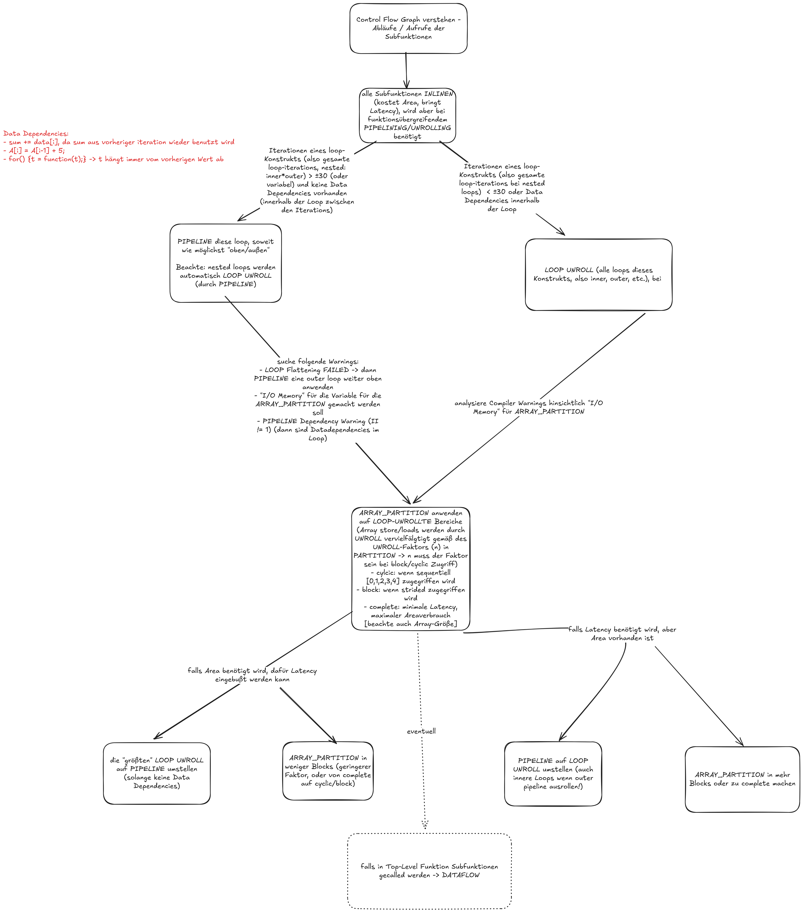

## Strategie

## Possible Fallacies
- in source gehören alle .cpp/.c files
- zu testbench alle .cpp/.c testbench files + alle .dat files
- .h files werden bei beiden automatisiert verwendet
- richtiges Directory verwenden
- richtiges Target auswählen
- für jede Lösung eine eigene Solution anlegen!
- nach jedem Schritt Synthetisieren
- checken, ob Synthesis und RTL/Cosimulation funktioniert
